# family-social

## 요청 URL

prefix로 `/api`를 붙입니다.

## Http Exception Filter

요청 실패시 아래 형식으로 응답합니다.

```
{
  success: false,
  timestamp: "2023-02-22T06:25:08.663Z",
  status: 404,
  message: "공지사항을 찾을 수 없습니다",
  path: "/api/users"
}
```

## Success Interceptor

요청 성공시 아래 형식으로 응답합니다.

```
{
  success: true,
  data: "Hello World!"
}
```

## 프리뷰

### PC

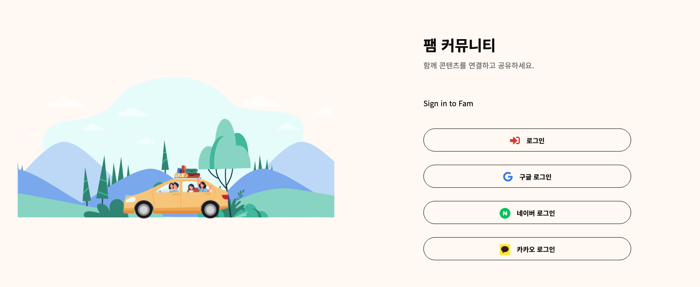
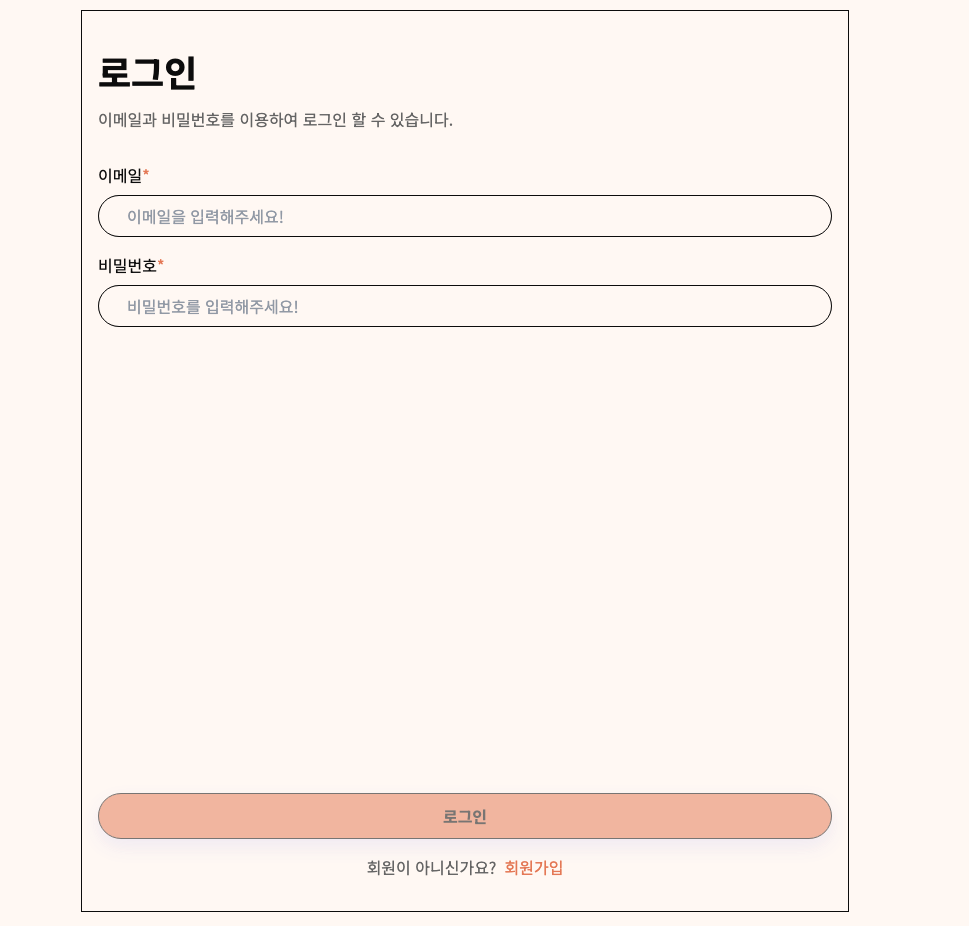
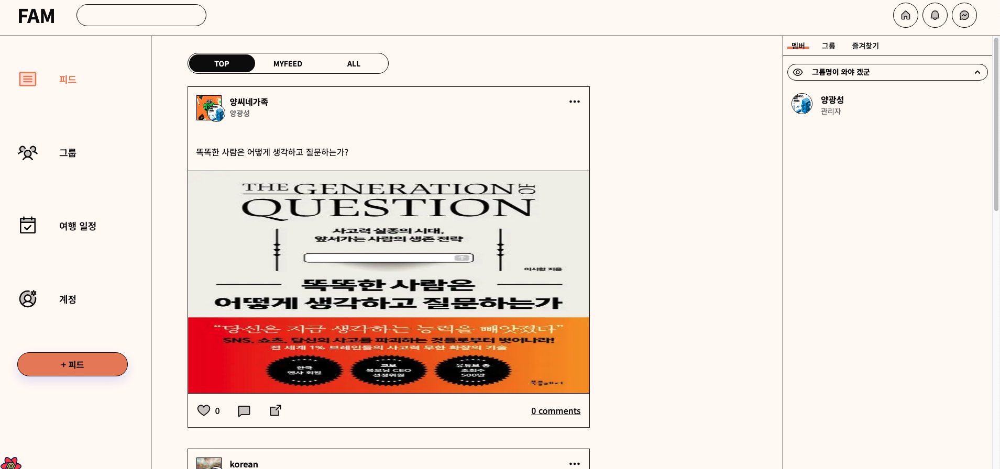
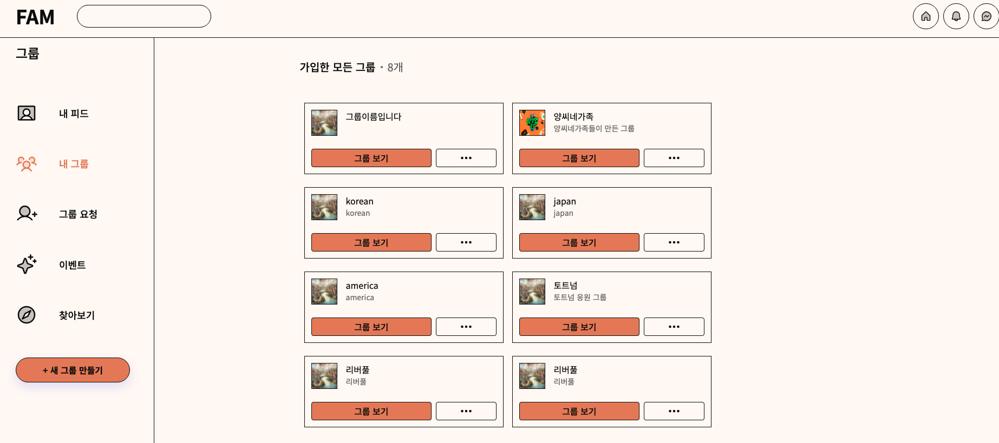
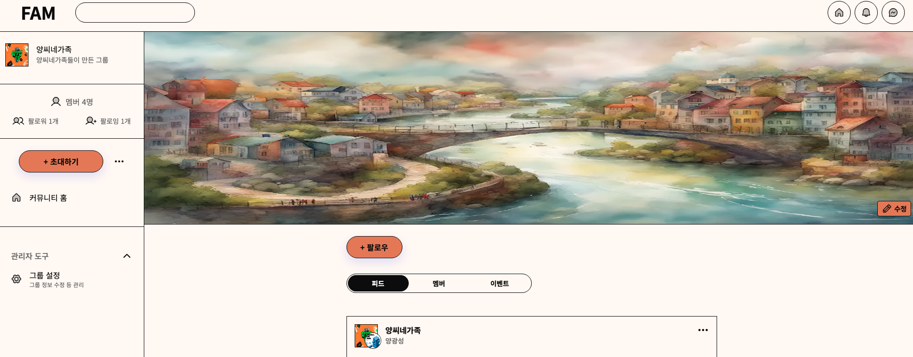
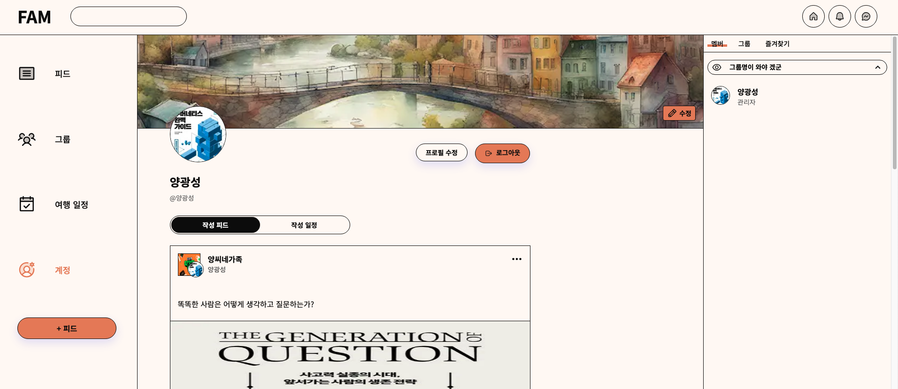
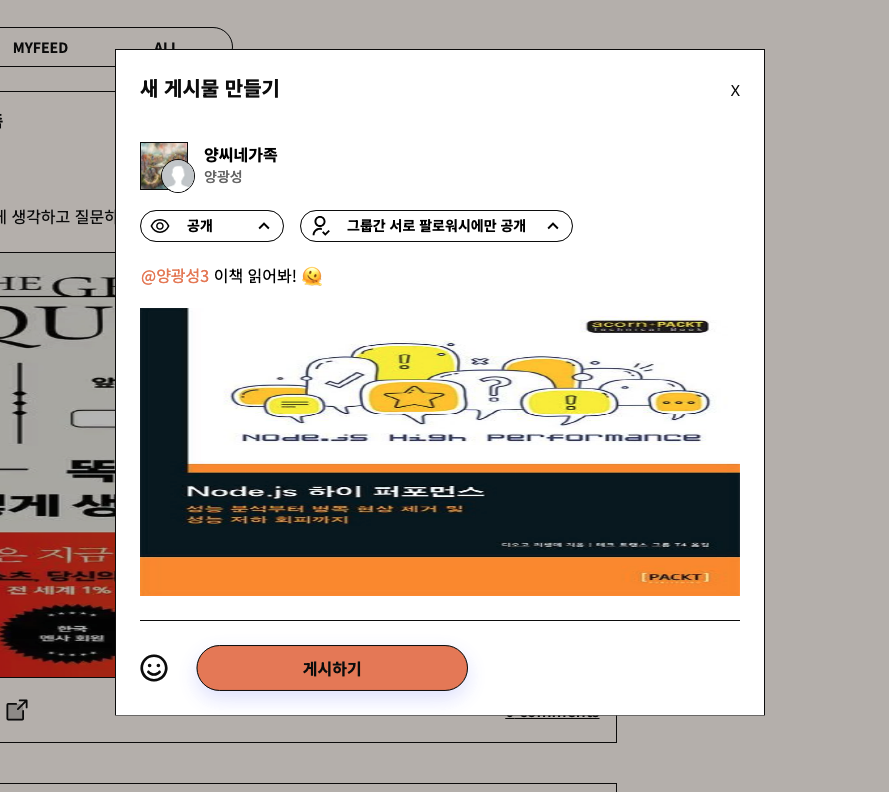
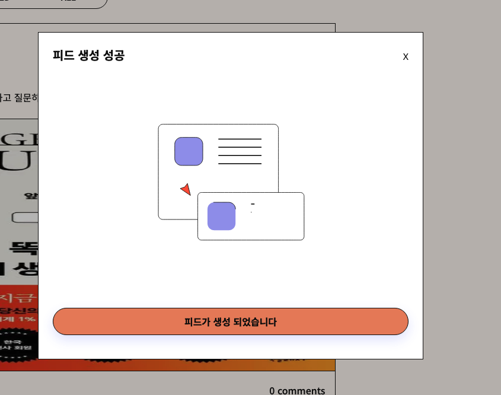
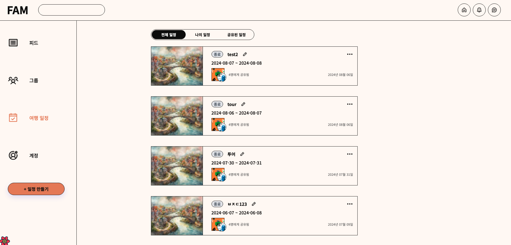
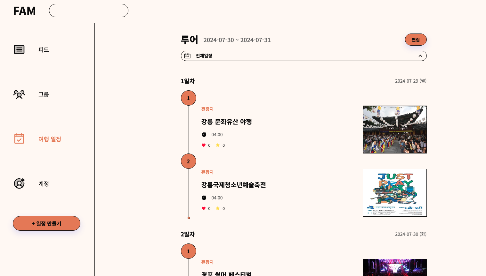
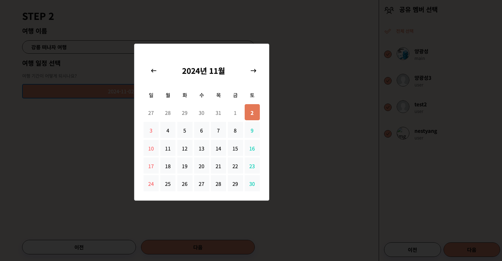
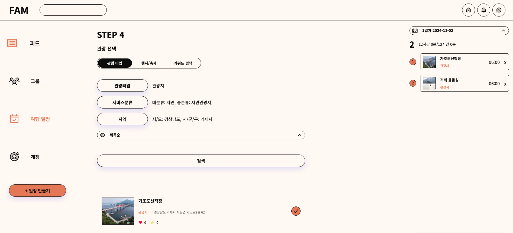

### Mobile

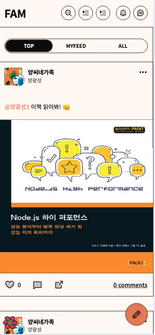
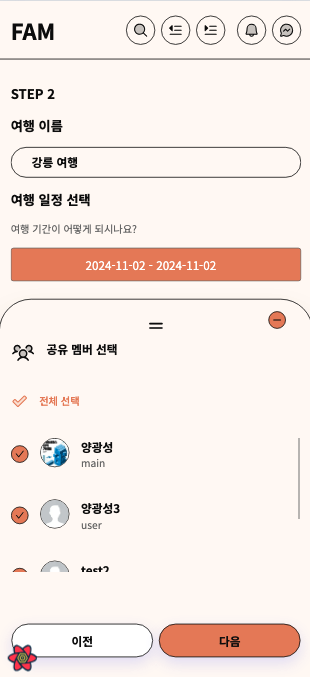
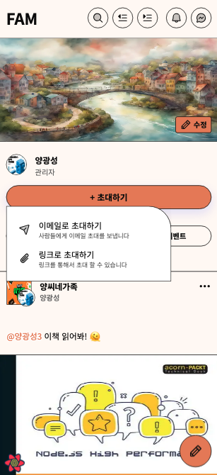

## Infra

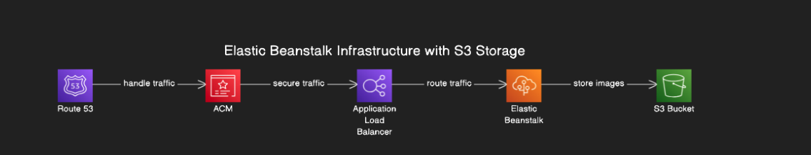

## 이런 고민을 했어요!

### backend

- [NestJS와 ioredis를 이용한 초대링크 만료 시간 설정하기](https://threeyears.tistory.com/599)
- [NestJS에서 Redis를 활용한 최근 검색어 기능 구현](https://threeyears.tistory.com/614)
- [NestJS에서 Redis를 활용한 좋아요 성능 개선](https://threeyears.tistory.com/621)
- [Log와 모니터링](https://threeyears.tistory.com/581)
- [NestJS에서 쿼리빌더의 결과 객체들을 병합하는 방법 with es-toolkit](https://threeyears.tistory.com/637)
- [NestJS Swaager 사용시 직관적이고 구체적인 응답 문서화 하기](https://threeyears.tistory.com/555)
- [NestJS ResponseDto 적극 활용하기](https://threeyears.tistory.com/553)
- [외부 api사용시 class-transformer의 클래스 인스턴스화 하기](https://threeyears.tistory.com/560)
- [Nestjs class-validator `ValidateNested` 데코레이터 n개의 중첩객체 validation 방법](https://threeyears.tistory.com/513)
- [cookie-option에서 `secure:true` 사용시 safari 브라우저에서 localhost에 cookie 저장이 안되는 문제](https://threeyears.tistory.com/517)
- [cookie-option에서 signed 옵션으로 cookie-parser 사용시 secret-key로 검증하여 보안 강화하기](https://threeyears.tistory.com/502)
- [pagination 기능을 위한 pagination module 생성시 발생하는 결합도를 낮추기 위한 Interceptor를 이용한 AOP 구현](https://threeyears.tistory.com/518)
- [NestJS에서 repository의 insert메서드로 유동적으로 데이터 생성하기](https://threeyears.tistory.com/526)
- [NestJS Response Dto에 generic을 swagger ApiProperty 데코레이터에 사용하기](https://threeyears.tistory.com/525)
- [TypeOrm과 js-joda를 이용한 Date타입 대신 LocalDateTime 타입 사용하기](https://threeyears.tistory.com/549)
- [production환경에서 Seed와 Migration 사용하기](https://threeyears.tistory.com/580)

### frontend

- [HOC(Higher-Order-Components)를 활용한 사용자 인증 정보 관심사 분리](https://threeyears.tistory.com/633)
- [react에서 useHover 커스텀훅과 hover시 modal 재사용 컴포넌트](https://threeyears.tistory.com/632)
- [NextJS getServerSideProps SSR에서 HOF를 이용한 auth 검증](https://threeyears.tistory.com/607)
- [react-query useMutation 커스텀훅으로 재사용하기](https://threeyears.tistory.com/618)
- [react-query useQuery 커스텀훅으로 재사용하기](https://threeyears.tistory.com/620)
- [lottie requestAnimationFrame handler took 문제 해결](https://github.com/YangGwangSeong/family-social/issues/59)
- [특정한 state 값에 따른 다른 페이지 랜더링을 효율적으로 랜더링 하는 방법에 대해](https://threeyears.tistory.com/515)
- [true/false toggle 메뉴 구현시 useReducer로 구현하기](https://threeyears.tistory.com/539)
- [태그된 유니온과 커스텀 타입가드를 이용한 다른 컴포넌트 랜더링](https://threeyears.tistory.com/570)
- [팩토리 패턴을 이용하여 동적 탭 메뉴 리스트 만들기](https://threeyears.tistory.com/578)
<!--

#### local 개발 환경에서 docker로 Redis aws 환경에서 aws ElasticCache

## TODO 프로젝트 완성 프리뷰 gif로 보여주기

## TODO 프로젝트 디렉토리 구조

## TODO 프로젝트 인프라 그림

## 기본적인 프로젝트 설명과 해당 프로젝트에서 사용하는 기술 socket.io, redis, sse 어떻게 적재적소로 사용 했는지에 대해

## 추후 추가 할 기능들에 대한 서술

## TODO 부하 테스트 (Artillery)

## Monitoring (Sentry + Slack + Winton)

## 반복적으로 진행하는 수동적인 작업에 불편을 느껴 자동화를 진행해본 경험 :

1. 이슈나 티켓 번호를 커밋 메세지마다 달아주는거 + 커밋 메시지 작성하는거,
2. husky를 이용한 eslint와 prettier 코드 검증 자동화
3. 자주 보는 기술 블로그들 자동 수집화
   -->
